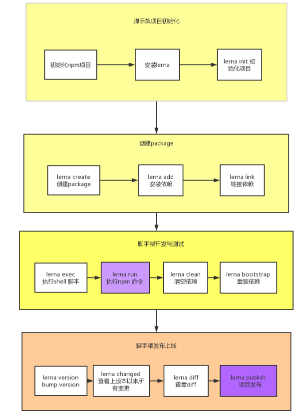
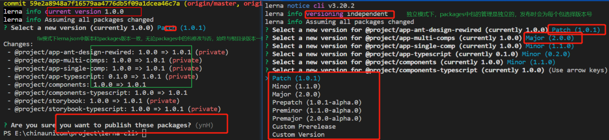

# 简介

通过lerna+yarn+react+ts的方式来管理包,
lerna的独立模式会让每个包单独发布和管理，创建lerna+monorepo项目是需要采用独立模式进行创建，项目搭建使用的规范

- 采用Independent模式
- 根据Git提交信息，自动生成changelog
- eslint规则检查
- prettier自动格式化代码
- 提交代码，代码检查hook
- 遵循semver版本规范
- **条件验证**: 如验证测试是否通过，是否存在未提交的代码，是否在主分支上进行版本发布操作
- **version_bump**:发版的时候需要更新版本号，这时候如何更新版本号就是个问题，一般大家都会遵循 semVer语义，
- **生成changelog**: 为了方便查看每个package每个版本解决了哪些功能，我们需要给每个package都生成一份changelog方便用户查看各个版本的功能变化。
- **生成git tag**：为了方便后续回滚问题及问题排查通常需要给每个版本创建一个git tag
- **git 发布版本**：每次发版我们都需要单独生成一个commit记录来标记milestone
- **发布npm包**：发布完git后我们还需要将更新的版本发布到npm上，以便外部用户使用

# lerna脚手架使用流程

解决痛点：

- 减少重复性的工作（多package本地link、本地依赖、单元测试、代码提交、代码发布）
- 版本一致性（发布时版本一致性和发布后版本升级）



# [lerna命令](https://lerna.js.org/)
```
1.全局安装lerna（管理员权限）
npm i lerna -g |yarn global add lerna
lerna  init --independent （创建独立模式的monorepo仓库）

2.项目安装依赖
lerna bootstrap --hoist | yarn install   //--hoist通过传递对包进行重复数据删除，通过生成软链接方式，根目录有的，不会在子目录中安装

3.包是否发生变化
lerna updated  | lerna diff  //修改指定包，可查对应修改的包和依赖被修改的包，辅助检查
lerna changed //列出下次发包更新的包

4.显示各个packages的version
lerna ls  | lerna list

5.清理node_modules
lerna clean (注意只能清除packages下node_modules,并不能删除根目录下面的node_modules,
建议：根目录执行脚本"clear-all": "rimraf node_modules && lerna clean -y")

6.运行shell脚本
$ lerna run <script> -- [..args] # 在所有包下运行指定

# 例如
$ lerna run test # 运行所有包的 test 命令
$ lerna run build # 运行所有包的 build 命令
$ lerna run --parallel watch # 观看所有包并在更改时发报，流式处理前缀输出

$ lerna run --scope my-component test # 运行 my-component 模块下的 test

7.创建packages包
lerna create <packagesname> [--dev] [--exact] //exact表示安装精确版本

8.发包
$ lerna publish # 用于发布更新
$ lerna publish --skip-git # 不会创建git commit或tag
$ lerna publish --skip-npm # 不会把包publish到npm上
$ lerna ls //列出当前lerna仓库中所有的公共软件包（注意公有的包才能发布【需要设置为public】，私有的需要付费）

9.安装依赖
$ lerna  add lodash --scope @ui/utils //指定packages安装依赖
$ lerna add packagesA --scope packageB //packages包内部安装依赖
$ lerna add <pluginname> //安装公共组件，会安装到根目录以及所有的子packages中的node_modules)(不建议，建议通过yarn workspace安装到根目录)


```


# yarn workspace命令

lerna中涉及到monorepo问题，通过yarn workspace命令来操作根目录和packages包

注意在使用yarn workspace需要在根目录的lerna.json中进行配置`"useWorkspaces": true,"npmClient": "yarn"`

```
1.多仓库安装（建议通过yarn处理依赖问题，通过lerna处理发布问题）
yarn install ====等价于====  lerna bootstrap --npm-client yarn --use-workspaces

2.执行所有packages下的clean|build操作(packages中script中需定义脚本)，该命令会执行所有packages中的脚本
yarn workspaces run clean|build...

3.运行指定包命令
yarn workspace <包名@ui/share> run clean|build

4.查看所有包之间的依赖
yarn workspaces info [json]

5.安装依赖
//根目录安装依赖
yarn add <pluginname> -D -W
yarn remove <pluginname> -D -W
···
yarn add lerna -D -W
npx lerna init  //初始化lerna.json
yarn add typescript -D -W
npx tsc --init //初始化tsconfig.json
···

6.指定packages下安装依赖（外部依赖）
yarn workspace <packagesname @ui/utils> add <pluginname> --
yarn workspace <packagesname @ui/utils> remove <pluginname> 

7.指定packages下安装依赖（内部依赖）
yarn worksapce <packagesname@ui/share> add <packagesname @ui/utils>
```


# 环境配置

1.git代码管理）
- 初始化git仓库`git init`,
- 创建git远程仓库，关联本地仓库

2.npm仓库
packages中管理的插件发布到官网或者私有服务器上

- 正确的仓库地址和用户名
```
1.查看本地npm registry 地址
npm config ls

2.切换需要发布的地址上（这里以npm官网为例）
两种方式切换源
（1）nrm方式
nrm ls
nrm use npm 
(1) 全局注册
npm config set registry https://registry.npmjs.org/
npm config get registry

3.npm官网注册账户并登录
https://www.npmjs.com/

4.电脑终端登录账户密码（见下图）
 yarn login //登录用户
 npm whoami //查看当前用户
 npm unpublish <--force>// 撤销发布(不建议)
 npm deprecate <pkg>[@<version>] <message> //建议使用
5.提交代码之后发布包（具体发包流程见多版本管理）
lerna publish //注意在发包之前先提交代码
```


# 多包版本管理和规范

lerna是monorepo项目，涉及不同包之间存在不同版本号的管理，在创建lerna项目采用独立模式创建，不同packages维护自身的版本号。发布之前需进行《环境配置环节》

## 1.monorepo独立模式配置

- 初始化独创建为独立模式`lerna init --independent`

- 修改根目录配置

  ```
  {
    "packages": ["packages/*"],//引入包名
    "useNx": true,
    "useWorkspaces": true,
    "npmClient": "yarn", //允许使用yarn workspace命令安装
    "version": "independent",
    "npmClient": "yarn", //允许使用yarn workspace命令安装
    "command": {
      "run": {
        "npmClient": "yarn"
      },
      "publish": {
        "ignoreChanges": ["ignored-file", "*.md"],
        "message": "chore(release): publish",
        "registry": "发布的仓库名称"
      }
    }
  }
  ```

fix模式和独立模式的区别在发布的区别见下图



## 2.packages中不同包packages.json配置

- packages中的子包名package.json中的包名如果是`@/package/name`带有的为private权限，如果要设置为公有的，需要做如下设置，此时才可进行发布，私有的情况下发包需要付费。

```
"publishConfig": {
    "access": "public"
  },
```

- 不同packages中管理的仓库发布与否，通过packages中的子包的package.json的`"private":true`,设置为私有，在`lerna publish`不会被发布，可通过`lerna ls`查看当前的可以发布插件

## 3.发布

### 3.1发布规范（语义化版本[semver](https://semver.org/)控制）


发布更新版本号

### 3.2发布流程


- 发布流程

  ```
  1.提交代码
  2.
  ```

  

通过`lerna publish` 发布版本

lerna publish from-package


# 规范化配置

- husky