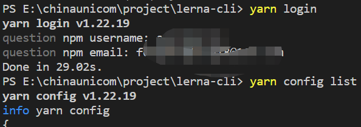

通过lerna+yarn+react+ts的方式来管理包,
lerna的独立模式会让每个包单独发布和管理，创建lerna+monorepo项目是需要采用独立模式进行创建
# lerna命令
```
1.全局安装lerna（管理员权限）
npm i lerna -g |yarn global add lerna

2.项目安装依赖
lerna bootstrap  | yarn install

3.包是否发生变化
lerna updated  | lerna diff 

4.显示各个packages的version
lerna ls

5.清理node_modules
lerna clean

6.运行shell脚本
$ lerna run <script> -- [..args] # 在所有包下运行指定

# 例如
$ lerna run test # 运行所有包的 test 命令
$ lerna run build # 运行所有包的 build 命令
$ lerna run --parallel watch # 观看所有包并在更改时发报，流式处理前缀输出

$ lerna run --scope my-component test # 运行 my-component 模块下的 test

7.创建packages名称
lerna create <packagesname>

8.发包
$ lerna publish # 用于发布更新
$ lerna publish --skip-git # 不会创建git commit或tag
$ lerna publish --skip-npm # 不会把包publish到npm上
```

# 环境配置
1.git代码管理）
- 初始化git仓库`git init`,
- 创建git远程仓库，关联本地仓库

2.npm仓库
packages中管理的插件发布到官网或者私有服务器上

- 正确的仓库地址和用户名
```
1.查看本地npm registry 地址
yarn config ls

2.切换需要发布的地址上（这里以npm官网为例）
nrm ls
nrm use npm 

3.npm官网注册账户并登录
https://www.npmjs.com/

4.电脑终端登录账户密码（见下图）
 yarn login
 
5.提交代码之后发布包（具体发包流程见多版本管理）
lerna publish
```



# 多包版本管理

通过`lerna publish` 发布版本

