# monorepo 多仓库管理+组件库部署

**名词解释**

多仓库：也可理解为多个包package的管理，每个包可以理解为我们的一个应用（h5应用程序，开发的工程项目等独立的项目）或者npm包（插件、具有单一功能的npm包、公共的基础组件库等），每个包之间都是独立的，相互之间不影响。

​       多个包放在一起管理的是他们之间的依赖关系（公共的依赖只安装在根目录，独有的安装在各自的package下，通过软连接的方式共用根目录的依赖），见下图。

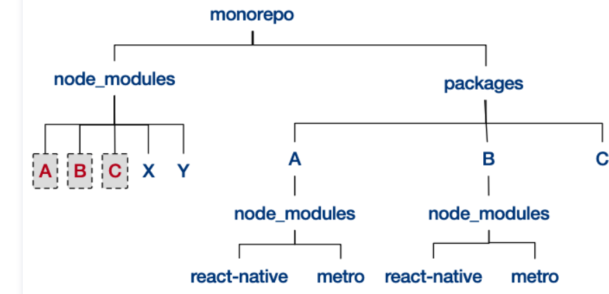


**适用场景**

多仓库适合： 基础框架，基础工具类，公共组件库 （ `h5` 组件库，`web` 组件库，`mobile` 组件库，以及对应的 `doc` 项目）。通过lerna来统一管理公共组件库的发布和版本维护。适合通用模块的管理，不涉及业务逻辑。

**技术调研**

调研：monorepo特点-> **快速、高效利用磁盘空间。** 

- pnpm  monorepo： 通过**软连接**方式添加依赖，所有的**依赖只需要下载一次** （未经验证）

- lerna+monorepo：通过**lerna管理仓库和下载依赖**，建立**软连接将公共依赖放在根目录**（经过验证）

**lerna**： 管理多个 npm 模块的工具 ，  Babel 自己用来维护自己的 Monorepo 并开源出的一个项目。优化维护多包的工作流，解决多个包互相依赖，**版本变更、项目发布**等都可以统一管理， 目前规模最多的repo管理工具 （[Taro-ui 组件库](https://github.com/NervJS/taro-ui)）

**pnpm**： 管理多包的工具。速度快 、 高效利用磁盘空间 、 支持 monorepo 、 严格（只能访问指定的依赖项package.json） 、 确定性 (pnpm-lock.yaml)

## 1.lerna多仓库管理（lerna+yarn）

大型的项目分为：业务模块和通用模块，通用的模块会被多个业务使用，这部分往往通过npm包提供服务。lerna中可以统一管理抽离的公共的通用模块以npm的方式发布和维护

解决的问题：

- 减少重复性的工作（**多package本地link**、本地依赖、单元测试、**代码规范化提交**、代码发布、**组件库版本同步升级**）
- 版本一致性（发布时版本一致性和发布后版本升级）

### 1.1 工作流

 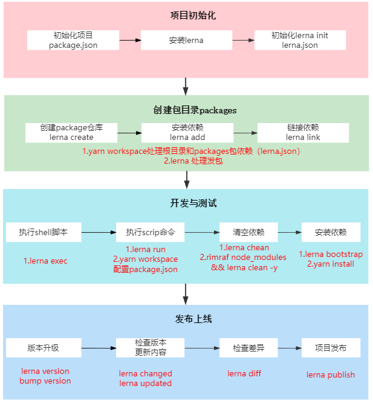

### 1.2 目录结构

**lerna仓库独立模式+yarn workspace命令+发布配置**、**根目录规范化配置**、**公共组件发布规范化配置**

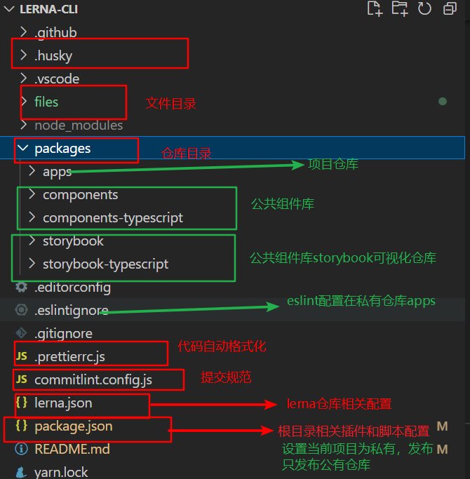


### 1.3 lerna.json+package.json配置

#### **lerna.json配置**

```lerna.json
{
  "packages": [
    "packages/*/*"    //4.指定仓库入口
  ],
  "version": "independent", //1.lerna仓库创建独立模式，发布不受影响
  "useNx": true,       
  "useWorkspaces": true,     //2.启用yarn workspace命令
  "npmClient": "yarn",       //2.启用yarn workspace命令
  "command": {   
    "run": {
      "npmClient": "yarn"   //2.启用yarn workspace命令（默认npm）
    },
    "publish": {            //3.发布组件配置（见2.2）
      "ignoreChanges": [   //发布插件忽略以下文件的该改变，lerna changed不会被检测
        "ignored-file",
        "*.md",
        "files"
      ],
      "message": "chore(release): publish",//执行发布版本更新时的自定义提交消息。更多细节见@lerna/version
      "registry": "发布的仓库名称"  //设置要发布的自定义注册 url，而非 npmjs.org，如果需要的话，您必须经过授权,也可不用写，直接设置registry发包
    },
    "version": {                           //发布插件启用规范化提交
      "conventionalCommits": true
    }
  }
}
```

#### **根目录package.json**

```
{
  "name": "root",
  "private": true,   // 设置仓库私有，不对外进行发布
  "scripts": {
    "commit": "git-cz", //提交规范
    "prepare": "husky install",  //校验规范
    "clear-all": "rimraf node_modules && lerna clean -y",  //清空本地所有的依赖
    //项目启动shell命令
    "start:app-ant-design": "yarn workspace @union-cli/app-ant-design-rewired start",
    "start:app-multi": "yarn workspace @union-cli/app-multi-comps start",
    "start:app-single": "yarn workspace @union-cli/app-single-comp start",
    "start:app-ts": "yarn workspace @union-cli/app-typescript start",
    "start:storybook": "yarn workspace @union-cli/storybook storybook",
    "start:storybook-ts": "yarn workspace @union-cli/storybook-typescript storybook"
  },
  "workspaces": {   		//1.配置工作项目录
    "packages": [
      "packages/apps/*",
      "packages/components",
      "packages/components-typescript",
      "packages/storybook",
      "packages/storybook-typescript"
    ],
   							 //2.配置开发环境：
    "production": true,         
    "development": true,
    "package-entry": "main:src",
    
    "nohoist": [
      "packages/apps/**/webpack-dev-server",
      "**/babel-loader",
      "**/babel-jest"
    ]
  },
  "devDependencies": {},
  "husky": {                     //3.校验规范配置
    "hooks": {
      "precommit": "lint-staged",
      "commit-msg": "commitlint -E HUSKY_GIT_PARAMS"
    }
  },
  "config": {                     //4.校验规范配置
    "commitizen": {
      "path": "./node_modules/cz-lerna-changelog"
    }
  },
  "lint-staged": {               //5.代码校验（只校验文件暂存区的代码）
    "*.{ts,tsx,js,jsx}": [
      "eslint --fix",
      "git add"]}}
```

### 1.4 **开发提交规范化配置**

所有的规范化配置只需在根目录即可，会应用到所有的子packages仓库中

#### 1.4.1 提交规范[commitizen](https://www.conventionalcommits.org/en/v1.0.0/) 

（`yarn add commitizen cz-lerna-changelog -D -W`，运行script`git cz`）

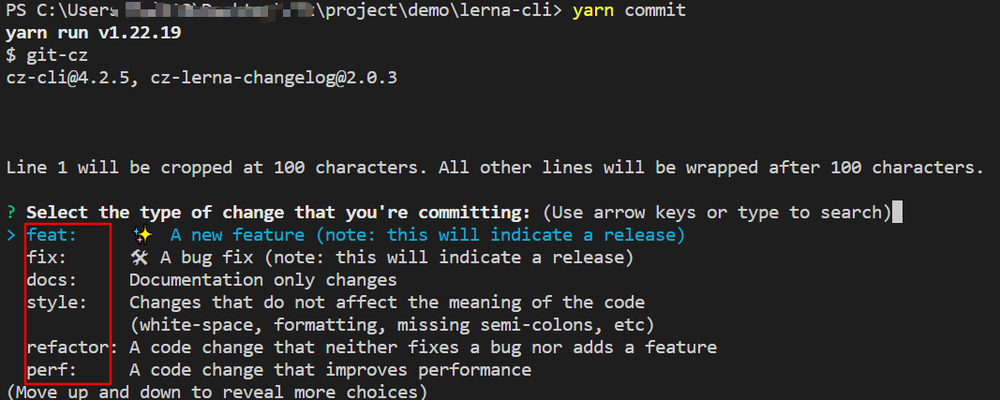

| type  | desc     | type     | desc                             |
| ----- | -------- | -------- | -------------------------------- |
| feat  | 新增功能 | fix      | 修复bug                          |
| docs  | 更改文档 | style    | 样式调整（空格，格式化，分号等） |
| build | 构建相关 | refactor | 重构，无修复bug和添加功能        |
| perf  | 性能优化 | revert   | 回退commit版本                   |

#### 1.4.2 commitlint&& [husky-v6](https://typicode.github.io/husky/#/)提交格式化

 commitlint(完成校验) && [husky-v6](https://typicode.github.io/husky/#/)提交格式化（确定校验时机）（`yarn add  @commitlint/cli @commitlint/config-conventional -D -W`&`yarn add  husky -D -W`）提交不合法提交失败

```
1.根目录配置文件 commitlint.config.js 
module.exports = { 
    extends: ['@commitlint/config-conventional'] 
}
2.根目录package.json添加`"husky"`
"script":{
	"prepare": "husky install" //yarn prepare
}
"husky": { 
         "hooks": { 
            "commit-msg": "commitlint -E HUSKY_GIT_PARAMS" 
     }
 }
 3.添加hook
 npx husky add .husky/pre-commit "npm test" //在.husky目录下新建一個pre-commit文件，
```

 "commit-msg":是git提交时校验提交信息的钩子，当触发时便会使用 commitlit 来校验 ,提交不符合规范不能提交

安装后提交`yarn commit`图见下

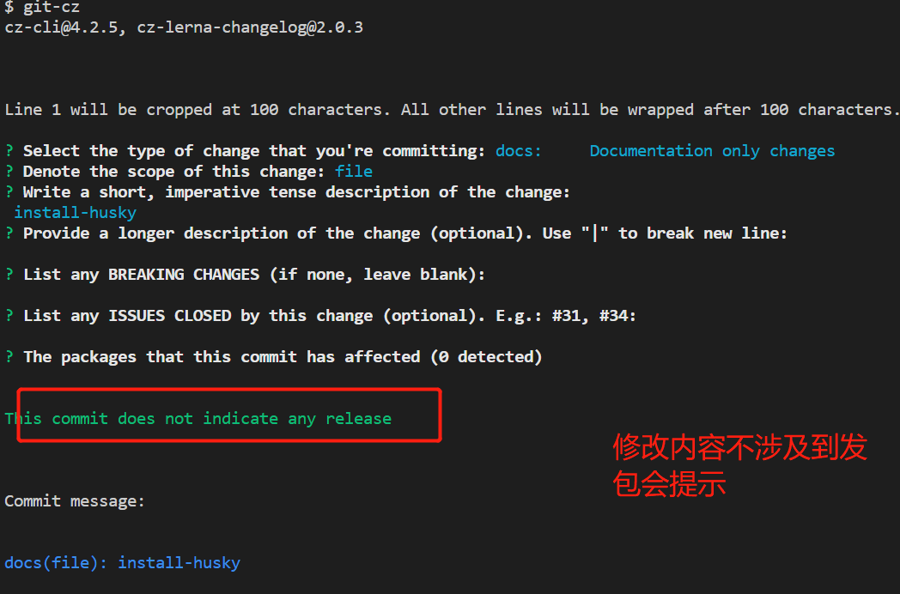

#### 1.4.3 eslint && lint-staged代码规范化

 `lint-staged staged` 是 Git 概念，表示暂存区，`lint-staged` 只检查并矫正暂存区中的文件提高校，可以校验效率，不会改变老的项目

- 安装插件`yarn add   standard lint-staged -D  -W`

- 配置根目录package.json

```
"lint-staged": {
    "*.ts": [
      "eslint --fix",
      "git add"
    ]
  },
```

- 安装eslint（eslint的配置文件这里主要放在packages下的子包）

```
yarn add eslint -D -W
//初始化，可以选择不同风格和编码，见下图
npx eslint --init
```

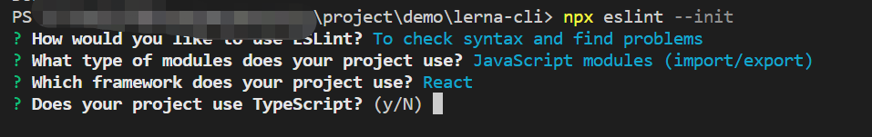


## 2.组件库规范化

lerna是monorepo项目，涉及不同包之间存在不同版本号的管理，在创建lerna项目采用独立模式创建，不同packages维护自身的版本号。 **每个 package 独立发布** 。

fix模式和独立模式的区别在发布的区别见下图


### 2.1 环境配置

1.git代码管理）

- 初始化git仓库`git init`,
- 创建git远程仓库，关联本地仓库

2.npm仓库
packages中管理的插件发布到官网或者私有服务器上(提供测试仓库：https://github.com/features/packages)[npm发包常会遇到的问题供参考](https://blog.csdn.net/u011194386/article/details/109714164)

- 正确的仓库地址和用户名

```
1.查看本地npm registry 地址
npm config ls

2.切换需要发布的地址上（这里以npm官网为例）
两种方式切换源
（1）nrm方式
nrm ls
nrm use npm 
(1) 全局注册
npm config set registry https://registry.npmjs.org/
npm config get registry

3.npm官网注册账户并登录
https://www.npmjs.com/
注意在发包的时候如果是"@组织名/pkg"命名的插件，需要在仓库中创建对应的组织名才能发布成功

4.电脑终端登录账户密码（见下图）
 yarn login //登录用户   npm login --registry=https://registry.npmjs.org/ 也可直接指定仓库
 npm whoami //查看当前用户
 npm unpublish <--force>// 撤销发布(不建议)
 npm deprecate <pkg>[@<version>] <message> //建议使用
5.提交代码之后发布包（具体发包流程见多版本管理）
lerna publish //注意在发包之前先提交代码
```

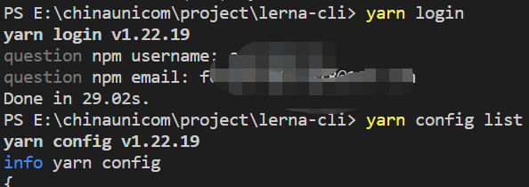

### 2.2 版本管理

- 仓库发包权限：packages中不同包packages-packages.json配置，设置`private：true`表示仓库是否公有，设置为私有，在`lerna publish`不会被发布，可通过`lerna ls`查看当前的可以发布插件

- packages中的子包名package.json中的包名如果是`@/package/name`带有的为private权限，如果要设置为公有的，需要做如下设置，此时才可进行发布，私有的情况下发包需要付费。ps：包名有前缀的情况下都需要添加

```
"publishConfig": {
    "access": "public"，
    "registry": "",//单个包配置npm地址
  },

```

- lerna在发布组件库时只会发布

### 2.3 发布

#### 2.3.1发布规范（语义化版本[semver](https://semver.org/)控制）

**语义化版本格式**：主版本号（major）.次版本号（minor）.修订号（patch）

- 主版本号：不兼容的 API 修改（进行不向下兼容的修改）
- 次版本号： 向下兼容的功能性增加（API 保持向下兼容的新增及修改）
- 修订号：向下兼容的问题修正（修复问题但不影响 API）

**版本选择**

- patch： 升级补丁版本号      fix
- minor： 升级小版本号          feat
- major： 升级大版本号 
- prepatch、preminor、premajor、prerelease：先行版本
  - 内部版本alpha：内部版本较多，处于开发阶段，存在bug，开发人员使用阶段
  - 公测版本beta：错误解决阶段，相较于alpha还需ui测试
  - rc：正式版本的候选阶段
- custom ：手动输入版本号
- custom version

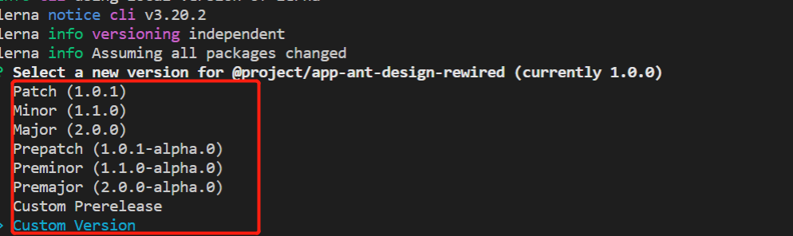

**版本范围通配符**

|              符号              |                             描述                             |
| :----------------------------: | :----------------------------------------------------------: |
|              `^`               | 表示同一主版本号中，不小于指定版本号的版本号<br>`^2.2.1` 对应主版本号为 2，不小于 `2.2.1` 的版本号，比如 `2.2.1`、`2.2.2` |
|               ~                | 表示同一主版本号和次版本号中，不小于指定版本号的版本号<br>`~2.2.1` 对应主版本号为 2，次版本号为 2，不小于 `2.2.1` 的版本号，比如 `2.2.1、2.2.2` |
| `>`、`<`、`=`、`>=`、`<=`、`-` | 用来指定一个版本号范围<br> `>2.1`  `1.0.0 - 1.2.0` // 注意使用 `-` 的时候，必须两边都有空格。 |
|              `||`              |                       表示或 `^2 <2.2`                       |
|         `x`、`X`、`*`          |    `*` 对应所有版本号 `3.x` 对应所有主版本号为 3 的版本号    |

#### 2.3.2发布流程

- 发布流程(发布之前提交代码)

  ```
  1. 运行lerna updated来决定哪一个包需要被publish
  2. 如果有必要，将会更新lerna.json中的version
  3. 将所有更新过的的包中的package.json的version字段更新
  4. 将所有更新过的包中的依赖更新
  5. 为新版本创建一个git commit或tag
  6. 将包publish到npm上
  7.撤销版本unpublish
  
  ```

- [`lerna publish`见文档](https://github.com/lerna/lerna/tree/main/commands/publish) 发布版本

```
$ lerna version # 发布前进行版本确认
$ lerna publish # 用于发布更新,之前不进行lerna version操作时，直接使用该命令也会进行lerna version操作，不带参数情况走bump version操作
$ lerna publish --skip-git # 不会创建git commit或tag
$ lerna publish --skip-npm # 不会把包publish到npm上
$ lerna publish from-package # 即根据 lerna 下的 package 里面的 pkg.json 的 version 变动来发包（ps：发布首次发包场景）
$ lerna publish from-git # 即根据 git commit 上的 annotaed tag 进行发包

```

通过lerna version +lerna publish效果如下：

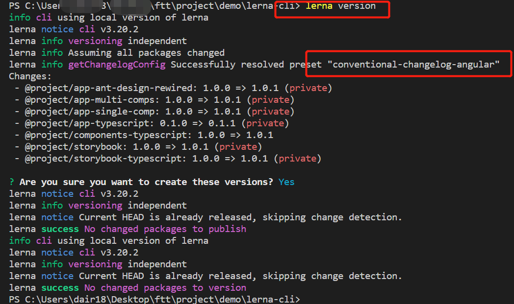

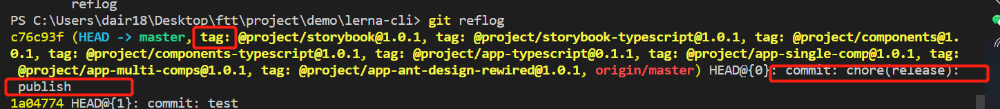

首次发包效果如下

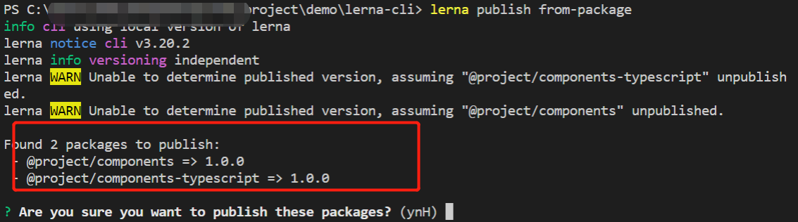

- 下架版本`npm unpublish [<@scope>/]<pkg>@<version> --force`

**lerna发布注意事项**

- 发布之前必须先commit
- 更改packages后，在提交时会自动检索修改的package，每次发布只发布修改过的package包，并在发布时将最新版本同步到内部依赖的其他package（根目录的文件修改在发布不会被检测）
- 提交版本更新和提交的commit选择的type类型有关系，在提交时务必规范提交`yarn commit`，eg：fix---patch，feat-minor
- 发布之前会打tag（通过tag我们可以检查每个版本的代码做保存和查看），并将tag推送到git仓库（也可手动打tag，运行命令`lerna publish from-git`发布,**建议手动打tag**）
- 首次创建的package发布运行`lerna publish from-package`,其无法检查到上次的commit

#### 2.3.3  内部模块依赖

新创建的package，引入内部模块`@scope/pkg`

```
1.---package.json
···
"devDependency"{
	"@scope/pkg":"^1.0.0"
}
···
2.建立软连接
lerna link
```

## 3.使用文档

### 3.1安装

####  环境准备

- Yarn 2.2.0
- Node 16.14.0

####  安装

```
git clone git@****.git
cd lerna-cli
yarn
```

#### 安装依赖

```
yarn workspace <workspace_name> <command>
```

- example

```
yarn workspace my-app(packagename) add react-router-dom(pluginname) --dev
```

This will add `react-router-dom` as `dependencies` in your `packages/my-app/package.json`. To remove dependency use `remove` instead of add

### 3.2 使用

**Starting Project in Workspace**

From your project root type start command for desired app

```
yarn workspace @union-cli/app-single-comp start
```

所有的script `start`

```
"scripts": {
    "start:app-ant-design": "yarn workspace @union-cli/app-ant-design-rewired start",
    "start:app-multi": "yarn workspace @union-cli/app-multi-comps start",
    "start:app-single": "yarn workspace @union-cli/app-single-comp start",
    "start:app-ts": "yarn workspace @union-cli/app-typescript start",
    "start:storybook": "yarn workspace @union-cli/storybook storybook",
    "start:storybook-ts": "yarn workspace @union-cli/storybook-typescript storybook",
    ...
  }
```

**Starting The Storybook**

```
yarn start:storybook
```

**Linting & Testing**

```
yarn workspace <workspace-root> test
```

**Creating a New CRA App**

Use Create React App's `--scripts-version` flag to create a new React App with Yarn Workspaces support.

```
react-app --scripts-version @react-workspaces/react-scripts my-app
```

To create new TS app use Create React App's `--template` flag with `--scripts-version` flag to create a new React App with Yarn Workspaces support and Typescript.

```
npx create-react-app --scripts-version @react-workspaces/react-scripts --template typescript my-ts-app
```

**公共组件库开发**

组件库包名：

```
 packages/components //js
 packages/components-typescript //ts
  "start:storybook": "yarn workspace @union-cli/storybook storybook",//js可视化文档撰写
  "start:storybook-ts": "yarn workspace @union-cli/storybook-typescript storybook",//ts可视化文档撰写
```

启动storyBook对应的项目`yarn start:storybook `，在对应的包`components`中开发组件即可

- 启动

  ```
  yarn start:storybook  || yarn start:storybook-ts //可视化启动
  ```

- 发版

  详细见2.3

  ```
   lerna version # 发布前进行版本确认
  $ lerna publish # 用于发布更新,之前不进行lerna version操作时，直接使用该命令也会进行lerna version操作，不带参数情况走bump version操作
  $ lerna publish --skip-git # 不会创建git commit或tag
  $ lerna publish --skip-npm # 不会把包publish到npm上
  $ lerna publish from-package # 即根据 lerna 下的 package 里面的 pkg.json 的 version 变动来发包（ps：发布首次发包场景）
  $ lerna publish from-git # 即根据 git commit 上的 annotaed tag 进行发包
  ```

- 使用

  ```
  切换到发布的镜像源
  
  npm  install 包名
  ```

## 4.总结

**集成配置**

- 采用Independent模式
- 根据Git提交信息，自动生成changelog
- eslint规则检查
- prettier自动格式化代码
- 提交代码，代码检查hook
- 遵循semver版本规范

**仓库功能**

基于yarn+lerna搭建monorepo仓库，仓库包含公共组件库（components & components-typescript），CRA Apps template（ts&js），以及storybook（ts&js）。仓库实现规范化配置（commiten）

- Yarn + [Lerna3](https://github.com/lerna/lerna) + TypeScript

- Create React App template with（ts&js）(react16)

- [Storybook 5](https://storybook.js.org/docs/react/get-started/introduction)（UI组件开发环境）

- [yarn workspace](https://yarn.bootcss.com/docs/workspaces)(控制多仓库包依赖和安装)

- Hot Reload all Apps, Components & Storybooks